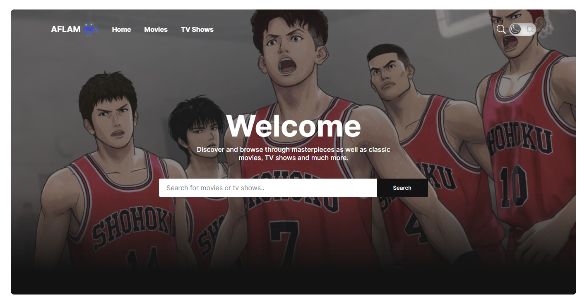

<h1 align="center">Aflam v2 - Movie App</h1>

<p align="center">A fully responsive react-based website built using The Movie Database (TMDB). This app allows users to browser through both movies and tv shows in various ways.</p>

<div align="center">
  
  
  [](https://twitter.com/intent/follow?screen_name=mabiorduom)
  
  

  <a href="https://aflaam.vercel.app/"><strong>➥ Live Demo</strong></a>

</div>



## 🛠 Installation and Setup 

Run the following commands:

``` bash
# Install packages and dependencies
npm install

# Run development server
npm run dev

# Build for production in the dist directory
npm run build
```

Give a ⭐ if you found this nice!
